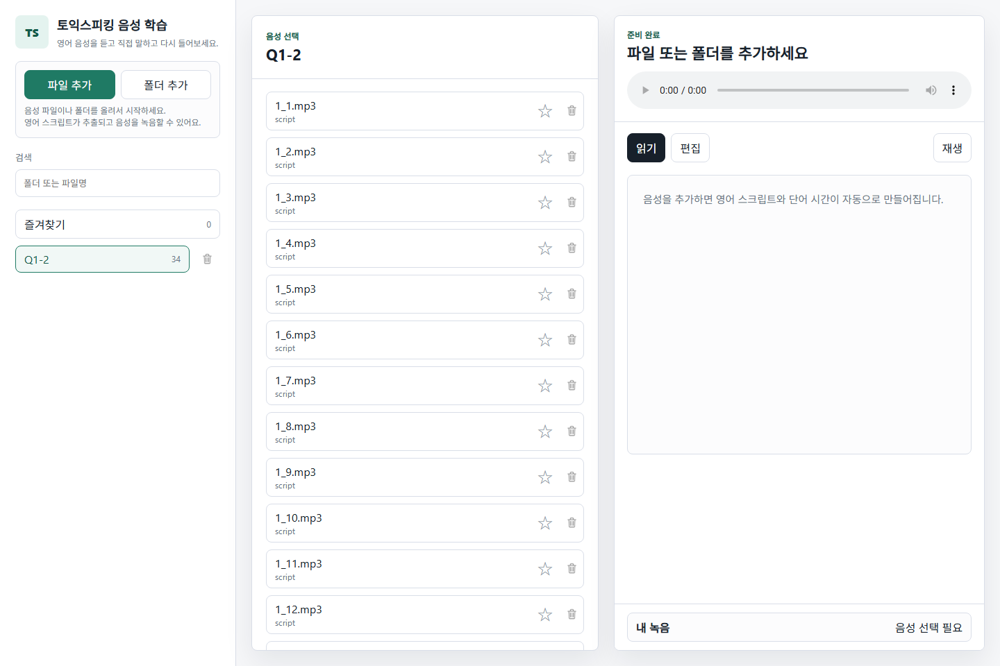

# TOEIC Speaking Audio Study

https://github.com/user-attachments/assets/936c185f-ec56-4684-ad9a-e766ace63031

음성 파일을 업로드하면 영어 스크립트와 단어별 재생 시간을 자동으로 만들어 주는 토익스피킹 학습 앱입니다. 

업로드한 음성을 스크립트를 보며 듣고, 단어를 눌러 원하는 위치로 바로 이동하고, 직접 따라 읽은 녹음도 같은 방식으로 확인할 수 있습니다.
영어 음성을 녹음하고 '스크립트 추출'버튼을 클릭하면 녹음본의 스크립트가 추출됩니다.



## 주요 기능

- 음성 파일 여러 개 또는 폴더 전체 추가
- 업로드 후 영어 스크립트 자동 추출
- 실제 음성을 기준으로 단어별 시작 시간 자동 생성
- 모델 준비, 대기, 처리 중, 완료 등 작업 현황 표시
- 스크립트 직접 수정 및 수동 단어 시간 자동 배치
- 단어를 눌러 해당 구간부터 바로 재생
- 자주 보는 음성 즐겨찾기
- 마이크로 따라 읽기 녹음 및 내 녹음 스크립트 보기
- 개별 음성 파일 또는 폴더 전체 삭제
- 모든 학습 자료를 내 컴퓨터에 저장

## 필요한 프로그램

- [Node.js](https://nodejs.org/) 18 이상
- [Python](https://www.python.org/downloads/) 3.10 이상
- 처음 음성 인식 모델을 받을 때 사용할 인터넷 연결

음성 인식은 `faster-whisper`를 사용합니다. 처음 한 번은 영어 인식 모델을 내려받기 때문에 시간이 조금 더 걸릴 수 있으며, 그다음부터는 컴퓨터에 저장된 모델을 재사용합니다.

## 내려받기

GitHub 저장소 화면에서 초록색 **Code** 버튼을 누른 뒤 **Download ZIP**을 선택하고 압축을 풉니다.

Git을 사용하는 경우에는 아래처럼 받을 수도 있습니다.

```bash
git clone <repository-url>
cd toeic-speaking-shareable
```

`<repository-url>`에는 이 GitHub 저장소의 주소를 넣어 주세요.

## 처음 설치하기

### Windows

압축을 푼 폴더에서 PowerShell을 열고 아래 명령을 차례로 실행합니다.

```powershell
python -m venv .venv
.venv\Scripts\python -m pip install -r requirements.txt
npm start
```

### macOS 또는 Linux

터미널에서 아래 명령을 차례로 실행합니다.

```bash
python3 -m venv .venv
.venv/bin/python -m pip install -r requirements.txt
npm start
```

실행 후 브라우저에서 [http://localhost:4173](http://localhost:4173)을 엽니다.

## 사용 방법

1. **파일 추가**를 눌러 음성 파일 여러 개를 선택하거나 **폴더 추가**를 눌러 폴더 전체를 선택합니다.
2. 화면에 표시되는 업로드 및 스크립트 추출 작업 현황을 확인하며 완료될 때까지 기다립니다.
3. 왼쪽 목록에서 학습할 음성을 선택합니다.
4. **스크립트** 탭에서 추출된 영어 문장을 보고, 원하는 단어를 눌러 그 위치부터 듣습니다.
5. 문장이 정확하지 않으면 **편집** 탭에서 직접 고칩니다.
6. 별 아이콘을 누르면 자주 보는 음성을 즐겨찾기에 모을 수 있습니다.
7. **내 녹음**에서 따라 읽기를 녹음하고, 녹음 스크립트를 추출해 다시 들을 수 있습니다.
8. 필요 없는 음성은 목록의 휴지통 버튼으로 지우고, 폴더 전체는 폴더 옆 휴지통 버튼으로 정리합니다.

자동 인식이 어려운 파일은 **편집** 탭에서 문장을 직접 입력한 뒤 **단어 시간 자동 배치**를 사용할 수 있습니다. 이 기능은 전체 재생 시간에 맞춰 단어 시간을 대략 배치하는 보조 기능입니다.

## 지원 음성 형식

`mp3`, `wav`, `m4a`, `aac`, `ogg`, `webm`, `flac`

## 저장 위치와 개인정보

이 앱은 별도의 음성 인식 웹 서비스에 파일을 보내지 않고, 실행 중인 컴퓨터에서 직접 음성을 처리합니다.

| 내용 | 저장 폴더 |
| --- | --- |
| 업로드한 음성 | `audio-library/` |
| 스크립트와 즐겨찾기 | `data/` |
| 내 녹음 | `recordings/` |
| 음성 인식 모델 캐시 | `.cache/` |

개인 학습 자료가 실수로 GitHub에 올라가지 않도록 위 폴더들은 `.gitignore`에 포함되어 있습니다. 저장소를 공개하기 전에 개인 음성 파일이 커밋에 들어가지 않았는지 한 번 더 확인해 주세요.

## 다음 실행부터

설치가 끝난 뒤에는 프로젝트 폴더에서 아래 명령만 실행하면 됩니다.

```bash
npm start
```

종료하려면 앱을 실행한 터미널에서 `Ctrl+C`를 누릅니다.

## 문제 해결

### 처음 스크립트 추출이 오래 걸립니다

첫 실행에서는 음성 인식 모델을 내려받고 준비합니다. 작업 현황에 모델 준비가 표시되면 잠시 기다려 주세요. CPU만 사용하는 컴퓨터에서는 음성 길이에 따라 추출 시간이 더 걸릴 수 있습니다.

### Python 또는 음성 인식 도구를 찾지 못합니다

Python 3.10 이상이 설치되어 있는지 확인한 뒤, 프로젝트 폴더에서 가상 환경과 필수 도구를 다시 설치합니다.

```powershell
python -m venv .venv
.venv\Scripts\python -m pip install -r requirements.txt
```

### 마이크 녹음이 되지 않습니다

주소가 `http://localhost:4173`인지 확인하고, 브라우저의 마이크 사용 요청을 허용해 주세요.

### 4173 포트를 이미 사용 중이라고 나옵니다

다른 번호로 실행할 수 있습니다. Windows PowerShell 예시는 다음과 같습니다.

```powershell
$env:PORT=4183
npm start
```

그다음 브라우저에서 `http://localhost:4183`을 엽니다.

## 선택 설정

필요한 경우 실행 전에 아래 환경 변수를 지정할 수 있습니다.

| 이름 | 기본값 | 설명 |
| --- | --- | --- |
| `PORT` | `4173` | 앱을 열 포트 번호 |
| `MAX_UPLOAD_MB` | `500` | 한 번에 허용할 최대 업로드 크기(MB) |
| `WHISPER_MODEL` | `base` | 사용할 Whisper 모델 이름 |
| `AUDIO_ROOT` | `audio-library/` | 음성 파일을 저장할 폴더 |
| `PYTHON_EXE` | 자동 검색 | 음성 인식에 사용할 Python 실행 파일 |

## 프로젝트 구성

```text
toeic-speaking-shareable/
├─ public/             화면과 동작 코드
├─ scripts/            영어 음성 인식 처리
├─ docs/images/        README용 앱 화면
├─ server.js           로컬 앱 서버
├─ requirements.txt    Python 필수 도구
└─ package.json        실행 정보
```

## GitHub에서 사용할 때 알아둘 점

이 저장소는 앱의 소스 코드를 공유하기 위한 것입니다. Node.js 서버와 Python 음성 인식이 함께 필요하므로 **GitHub Pages에서 앱 전체를 바로 실행할 수는 없습니다.** 사용하는 사람은 저장소를 내려받아 자신의 컴퓨터에서 실행해야 합니다.

음성 인식 결과는 녹음 환경, 발음, 배경 소음에 따라 정확도가 달라질 수 있습니다. 중요한 문장은 추출 후 직접 확인하고 편집해 주세요.
